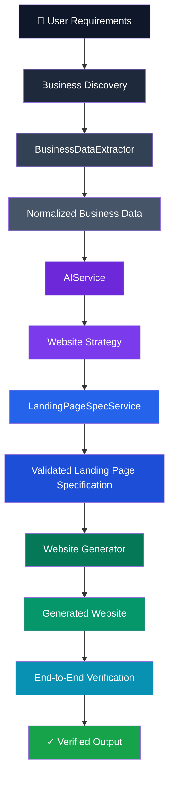

# ⚡ SiteForge

### AI-Powered Business Website Generation Infrastructure

> **Transform business data into production-ready website specifications and experiences.**

SiteForge is an end-to-end AI website generation platform that transforms real-world business information and user requirements into **structured website strategy, validated landing-page specifications, and generated websites**.

Rather than treating an LLM as a black-box website builder, SiteForge places AI inside a **controlled software pipeline** built around data extraction, normalization, domain contracts, structured generation, validation, error handling, and end-to-end verification.

<br>

<p align="center">


</p>

<p align="center">


</p>

---

## ◈ The Problem

Creating a high-quality business website requires much more than generating HTML.

A typical workflow involves:

```text
Business Discovery
       ↓
Data Collection
       ↓
Data Normalization
       ↓
Business Understanding
       ↓
Website Strategy
       ↓
Information Architecture
       ↓
Content Strategy
       ↓
Landing Page Specification
       ↓
Website Generation
       ↓
Validation
       ↓
Deployment
```

Traditional workflows require humans to manually perform most of these steps.

Naive AI website builders attempt to compress everything into:

```text
Prompt → LLM → Website
```

That approach is fast, but difficult to control, validate, debug, or trust.

### SiteForge takes a different approach.

```text
┌──────────────────────────────────────────────────────────────┐
│                        SITEFORGE                             │
├──────────────────────────────────────────────────────────────┤
│                                                              │
│  REAL-WORLD DATA                                              │
│         │                                                    │
│         ▼                                                    │
│  ┌──────────────────┐                                        │
│  │ Data Extraction  │                                        │
│  └────────┬─────────┘                                        │
│           ▼                                                  │
│  ┌──────────────────┐                                        │
│  │ Normalization    │                                        │
│  └────────┬─────────┘                                        │
│           ▼                                                  │
│  ┌──────────────────┐                                        │
│  │ AI Reasoning     │                                        │
│  └────────┬─────────┘                                        │
│           ▼                                                  │
│  ┌──────────────────┐                                        │
│  │ Validation       │                                        │
│  └────────┬─────────┘                                        │
│           ▼                                                  │
│  ┌──────────────────┐                                        │
│  │ Site Generation  │                                        │
│  └────────┬─────────┘                                        │
│           ▼                                                  │
│  ┌──────────────────┐                                        │
│  │ E2E Verification │                                        │
│  └──────────────────┘                                        │
│                                                              │
└──────────────────────────────────────────────────────────────┘
```

---

# ✦ Engineering Philosophy

SiteForge is built around one core idea:

> **AI should operate inside a reliable software system, not become the software system.**

### The architecture deliberately separates:

| Layer            | Responsibility                                         |
| ---------------- | ------------------------------------------------------ |
| **Data**         | Discover and normalize real-world business information |
| **Intelligence** | Generate strategic recommendations                     |
| **Domain**       | Represent website strategy and page specifications     |
| **Generation**   | Convert specifications into websites                   |
| **Validation**   | Verify contracts and generated output                  |
| **Testing**      | Verify the entire pipeline                             |

This separation makes the system easier to reason about, test, debug, and extend.

---

# 🧬 System Architecture



---

# ⚙️ Core Pipeline

## 01 — Business Discovery

SiteForge begins with real-world business information.

The extraction layer handles information such as:

* Business name
* Business category
* Address
* Locality
* City
* State
* Country
* Coordinates
* Contact information
* Business metadata
* Place identifiers
* Maps information

External representations are normalized before entering the internal pipeline.

### Why this matters

External APIs and business platforms rarely provide perfectly consistent data.

SiteForge isolates that complexity inside the extraction layer rather than allowing external-data quirks to leak into the rest of the application.

---

## 02 — Data Normalization

Raw external information is converted into a stable internal representation.

```js
{
  name,
  category,
  address,
  locality,
  city,
  state,
  country,
  latitude,
  longitude,
  phone,
  website,
  rating,
  reviewCount
}
```

The objective is simple:

> **Downstream services should depend on a stable domain model, not on external API formats.**

---

# 🧠 03 — AI Website Strategy

Normalized business data is passed into the AI orchestration layer.

The AI generates a structured website strategy covering:

* Business goals
* Target audience
* Primary CTA
* Secondary CTA
* Page architecture
* Homepage structure
* Trust strategy
* Conversion funnel
* SEO strategy
* Visual direction
* Content strategy
* Mobile strategy
* Implementation requirements

Example:

```json
{
  "websiteGoal": "Establish a credible local online presence and generate leads.",
  "primaryCTA": {
    "action": "contact",
    "text": "Get in Touch"
  },
  "secondaryCTA": {
    "action": "visit",
    "text": "Find Our Store"
  },
  "pages": [
    {
      "name": "Home",
      "priority": "essential"
    },
    {
      "name": "Contact",
      "priority": "essential"
    }
  ]
}
```

The important architectural decision:

> **The LLM generates a domain object, not arbitrary HTML.**

---

# 🛡️ 04 — Confidence-Aware AI

One of the biggest risks in AI-generated business websites is hallucination.

Suppose the available data confirms only:

```text
Business Name
Location
Coordinates
```

The model should not suddenly invent:

```text
20+ years of experience
Award-winning service
5000+ happy customers
Premium furniture collection
```

SiteForge therefore distinguishes between different information states.

```text
                         BUSINESS INFORMATION
                                  │
                ┌─────────────────┼─────────────────┐
                ▼                 ▼                 ▼
            VERIFIED           INFERRED          SUGGESTED
                │                 │                 │
                ▼                 ▼                 ▼
          Factual data       AI reasoning       Strategy
          from sources       requiring care     recommendation
```

Conceptually:

```json
{
  "text": "Furniture and home products",
  "status": "inferred",
  "source": "llm_inference"
}
```

versus:

```json
{
  "text": "123 Example Street",
  "status": "verified",
  "source": "business_data"
}
```

This creates an explicit boundary between:

**Facts → Inference → Recommendations**

---

# 🧩 05 — Intermediate Website Specification

SiteForge does not jump directly from strategy to HTML.

Instead:

```text
User Input
     ↓
Business Data
     ↓
Website Strategy
     ↓
Landing Page Specification
     ↓
Website Implementation
```

The `LandingPageSpecService` converts strategic decisions into an implementation-oriented specification.

For example:

```text
Hero
  ↓
Local Presence
  ↓
Products / Services
  ↓
Why Choose Us
  ↓
About
  ↓
Conversion CTA
  ↓
Contact / Footer
```

Each section can define:

* Purpose
* Order
* Key messages
* CTA requirements
* Content requirements
* Conversion objectives
* Visual direction

---

# 🔒 Why Intermediate Representations?

A monolithic architecture would look like:

```text
Prompt
  ↓
LLM
  ↓
HTML
```

SiteForge instead uses:

```text
Input
  ↓
Data
  ↓
Strategy
  ↓
Specification
  ↓
Implementation
```

This introduces more structure, but provides significantly more control.

Each stage can be:

* Validated independently
* Tested independently
* Debugged independently
* Replaced independently
* Versioned independently
* Improved without rewriting the entire pipeline

### Engineering tradeoff

> **More intermediate structure in exchange for greater control, observability, and maintainability.**

---

# 🔐 06 — AI Output Validation

LLM output is treated as **untrusted external input**.

The pipeline follows:

```text
             LLM Response
                   │
                   ▼
             ┌───────────┐
             │   Parse   │
             └─────┬─────┘
                   │
                   ▼
          ┌─────────────────┐
          │ Schema Validate │
          └────────┬────────┘
                   │
             ┌─────┴─────┐
             │           │
           INVALID      VALID
             │           │
             ▼           ▼
        Retry / Error   Domain Object
                         │
                         ▼
                    Next Stage
```

This protects downstream components from malformed AI responses.

And importantly:

```text
Valid JSON
    ≠
Valid Application Data
```

For example:

```json
{
  "websiteGoal": 42
}
```

is valid JSON.

It is not necessarily valid SiteForge data.

---

# 🧱 07 — Service Boundaries

SiteForge uses explicit service boundaries.

```text
┌─────────────────────────────────────────────────────┐
│                 APPLICATION PIPELINE                │
├─────────────────────────────────────────────────────┤
│                                                     │
│ BusinessDataExtractor                               │
│         │                                           │
│         ▼                                           │
│ AIService                                            │
│         │                                           │
│         ▼                                           │
│ Website Strategy                                     │
│         │                                           │
│         ▼                                           │
│ LandingPageSpecService                               │
│         │                                           │
│         ▼                                           │
│ Website Generator                                    │
│                                                     │
└─────────────────────────────────────────────────────┘
```

Each component has a specific responsibility.

This follows the principle:

> **High cohesion within services, low coupling between services.**

---

# 🔌 AI Provider Abstraction

`AIService` acts as the boundary between SiteForge and the underlying model provider.

Responsibilities include:

* Prompt construction
* Model invocation
* Context preparation
* Response extraction
* Structured generation
* JSON parsing
* Error handling
* Generation metadata

Downstream services should not need to know provider-specific details.

Conceptually:

```js
const result = await AIService.generate({
  prompt,
  schema,
  context
});
```

This allows the rest of the application to remain independent from the underlying AI implementation.

---

# 🚨 Error Handling & Failure Isolation

A major goal of SiteForge is to preserve the **true origin of failures**.

### External data failure

```text
External Source
      ↓
BusinessDataExtractor
      ↓
Extraction Error
```

### AI generation failure

```text
AI Provider
      ↓
AIService
      ↓
Generation Error
```

### Contract failure

```text
AI Output
      ↓
Schema Validation
      ↓
Contract Error
```

### Pipeline failure

```text
Service A
   ↓
Service B
   ↓
Service C
   ↓
Integration Failure
```

This distinction is critical in multi-stage systems.

Otherwise a deep pipeline failure can eventually become the useless:

```text
Something went wrong.
```

---

# 🧪 Testing Strategy

SiteForge uses pipeline-level testing to validate interactions between services.

```text
                    INPUT
                      │
                      ▼
              Business Extraction
                      │
                      ▼
               Strategy Generation
                      │
                      ▼
             Landing Page Specification
                      │
                      ▼
                Site Generation
                      │
                      ▼
                E2E Verification
                      │
                      ▼
                    OUTPUT
```

Testing the entire pipeline catches issues that isolated unit tests cannot.

For example, two services may individually work perfectly while disagreeing about:

* Argument order
* Field names
* Data types
* Optional values
* Expected object shape
* Output contracts

This is why integration and end-to-end testing matter.

---

# 🔍 Debugging Philosophy

SiteForge development follows a failure-tracing approach.

Instead of immediately modifying the line where an exception appears:

```text
Error
 ↓
Stack Trace
 ↓
Service Boundary
 ↓
Input Contract
 ↓
Transformation
 ↓
Actual Root Cause
```

For example:

```text
"AI returned invalid JSON"
```

does not necessarily mean the JSON parser is the root problem.

The actual failure may have occurred earlier:

```text
Incorrect arguments
       ↓
Malformed prompt/context
       ↓
Unexpected AI output
       ↓
JSON parsing failure
```

This is an important distinction when debugging distributed or multi-stage pipelines.

---

# 📐 Engineering Principles Used

## Separation of Concerns

Each service owns a specific responsibility.

## Abstraction

External providers are hidden behind service interfaces.

## Data Normalization

External data is converted into stable internal structures.

## Domain Modeling

Website strategy and page specifications are represented as structured domain objects.

## Defensive Programming

AI output and external data are treated as untrusted inputs.

## Contract-Based Design

Services communicate through explicit expected data structures.

## Failure Isolation

Errors are detected and propagated at the appropriate system boundary.

## Testability

Intermediate stages allow focused testing and end-to-end verification.

## Extensibility

New generators, AI providers, business-data sources, and website types can be introduced without redesigning the entire system.

---

# 🏗️ Architecture Decision: AI + Deterministic Software

The central architecture can be summarized as:

```text
                 PROBABILISTIC
                 ┌─────────────┐
                 │     AI      │
                 │  Reasoning  │
                 └──────┬──────┘
                        │
                        ▼
              ┌──────────────────┐
              │   VALIDATION     │
              └────────┬─────────┘
                       │
                       ▼
              ┌──────────────────┐
              │ DOMAIN CONTRACTS │
              └────────┬─────────┘
                       │
                       ▼
              ┌──────────────────┐
              │ DETERMINISTIC    │
              │   PIPELINE       │
              └──────────────────┘
```

The AI provides flexibility.

The deterministic layers provide control.

The combination is what makes the system useful.

---

# 📊 Example Website Strategy

A generated strategy may contain:

```text
Website Goal
├── Establish local credibility
├── Generate leads
└── Drive store visits

Target Audience
├── Local residents
└── Potential customers

Conversion
├── Primary CTA
│   └── Get in Touch
└── Secondary CTA
    └── Find Our Store

Pages
├── Home
├── Contact
├── About
├── Services / Products
└── Gallery

Strategy
├── SEO
├── Trust
├── Content
├── Mobile
└── Visual Direction
```

The result is not simply generated copy.

It is a structured representation of **why the website should exist and how it should convert users.**

---

# 📁 Repository Structure

```text
SiteForge/
│
├── apps/
│   │
│   └── api/
│       │
│       ├── src/
│       │   │
│       │   ├── services/
│       │   │   ├── AIService.js
│       │   │   ├── BusinessDataExtractor.js
│       │   │   ├── LandingPageSpecService.js
│       │   │   └── ...
│       │   │
│       │   └── ...
│       │
│       └── test_full_pipeline_fixed.js
│
├── ...
│
└── README.md
```

The architecture keeps core business capabilities inside dedicated services rather than creating a single monolithic controller.

---

# 🧠 Key Engineering Challenges

### Probabilistic AI inside deterministic software

LLMs can produce unexpected outputs.

The surrounding system therefore needs:

* Validation
* Structured contracts
* Parsing
* Error handling
* Retry strategies
* Observability

### Incomplete real-world data

Real businesses rarely have perfectly complete information.

The system must distinguish:

```text
Missing
  ≠
False
  ≠
Inferred
```

### External API variability

External systems can expose the same entity through different identifiers and formats.

Normalization prevents this complexity from spreading through the codebase.

### Cross-service contracts

A pipeline can fail even when every individual service appears correct.

Integration testing is therefore essential.

---

# ⚖️ Architectural Tradeoffs

| Decision                    | Benefit                   | Cost                        |
| --------------------------- | ------------------------- | --------------------------- |
| Modular services            | Maintainability           | More interfaces             |
| Intermediate specifications | Control                   | Additional processing       |
| AI abstraction              | Provider independence     | Extra abstraction layer     |
| Validation                  | Reliability               | Latency / complexity        |
| E2E testing                 | Realistic verification    | More expensive tests        |
| Confidence-aware data       | Safer content             | More complex domain model   |
| Normalization               | Stable internal contracts | Upfront transformation work |

SiteForge intentionally accepts additional complexity where it produces better reliability and maintainability.

---

# 🚀 Future Engineering Roadmap

### Reliability

* Runtime schema validation
* Structured LLM output enforcement
* Automatic retries
* Failure classification
* Circuit-breaking for external dependencies

### Architecture

* Typed service contracts
* Provider abstraction
* Versioned specifications
* Event-driven generation jobs
* Background workers

### Performance

* Response caching
* External-data caching
* Parallel pipeline stages where safe
* Generation cost tracking
* Latency instrumentation

### Observability

* Structured logging
* Pipeline tracing
* Per-stage latency metrics
* AI token / cost metrics
* Failure dashboards

### Quality

* Automated visual regression testing
* Accessibility validation
* SEO validation
* Generated-content quality scoring
* Provenance enforcement

### Infrastructure

* Persistent generation history
* Job queues
* Automated deployment
* Multi-tenant architecture
* Versioned website builds

---

# 📌 Tech Stack

> Keep this section synchronized with the actual repository.

| Category     | Technology                                             |
| ------------ | ------------------------------------------------------ |
| Runtime      | Node.js                                                |
| Language     | JavaScript                                             |
| AI           | LLM API integration                                    |
| Architecture | Modular service pipeline                               |
| Data         | Business / location extraction                         |
| Testing      | Integration + E2E testing                              |
| Output       | Structured website specifications + generated websites |

---

# 🔬 What This Project Demonstrates

SiteForge demonstrates practical experience with:

```text
Backend Engineering
       +
System Design
       +
AI Engineering
       +
API Integration
       +
Data Normalization
       +
Domain Modeling
       +
Validation
       +
Testing
       +
Reliability Engineering
```

More specifically:

* Designing multi-stage backend pipelines
* Building service boundaries
* Integrating probabilistic AI into deterministic systems
* Handling unreliable external inputs
* Designing intermediate representations
* Creating structured AI outputs
* Validating domain contracts
* Debugging cross-service failures
* Building end-to-end tests
* Designing for extensibility and maintainability

---

# ⭐ Why SiteForge Exists

Most AI website builders optimize for:

> **Generate something quickly.**

SiteForge focuses on:

> **Generate something useful, explainable, structured, and controllable.**

The distinction matters.

A reliable AI system cannot simply assume that the model will always behave correctly.

It needs architecture around the model.

---

# 🧭 Engineering Takeaway

SiteForge began with a simple question:

> **Can AI generate a website?**

The more interesting engineering question became:

> **How do you build a reliable software system around a probabilistic model while preventing bad data, hallucinations, malformed output, and service-level failures from propagating through the pipeline?**

That question drives the architecture of SiteForge.

```text
             ┌───────────────────────────┐
             │     REAL-WORLD DATA       │
             └─────────────┬─────────────┘
                           │
                           ▼
             ┌───────────────────────────┐
             │    DETERMINISTIC CORE     │
             │                           │
             │  Normalize → Validate     │
             │       → Contract          │
             └─────────────┬─────────────┘
                           │
                           ▼
             ┌───────────────────────────┐
             │    PROBABILISTIC AI       │
             │                           │
             │      Reason → Generate    │
             └─────────────┬─────────────┘
                           │
                           ▼
             ┌───────────────────────────┐
             │    VALIDATED DOMAIN       │
             │       SPECIFICATION       │
             └─────────────┬─────────────┘
                           │
                           ▼
             ┌───────────────────────────┐
             │      WEBSITE OUTPUT       │
             └─────────────┬─────────────┘
                           │
                           ▼
             ┌───────────────────────────┐
             │      E2E VERIFICATION     │
             └───────────────────────────┘
```

### **SiteForge**

**Probabilistic intelligence. Deterministic engineering. Reliable output.**

---

## 👤 Author

**Suraj Kumar**

Computer Science & Engineering

Focused on:

`Backend Engineering` · `System Design` · `AI Engineering` · `Software Architecture` · `Distributed Systems`

---
